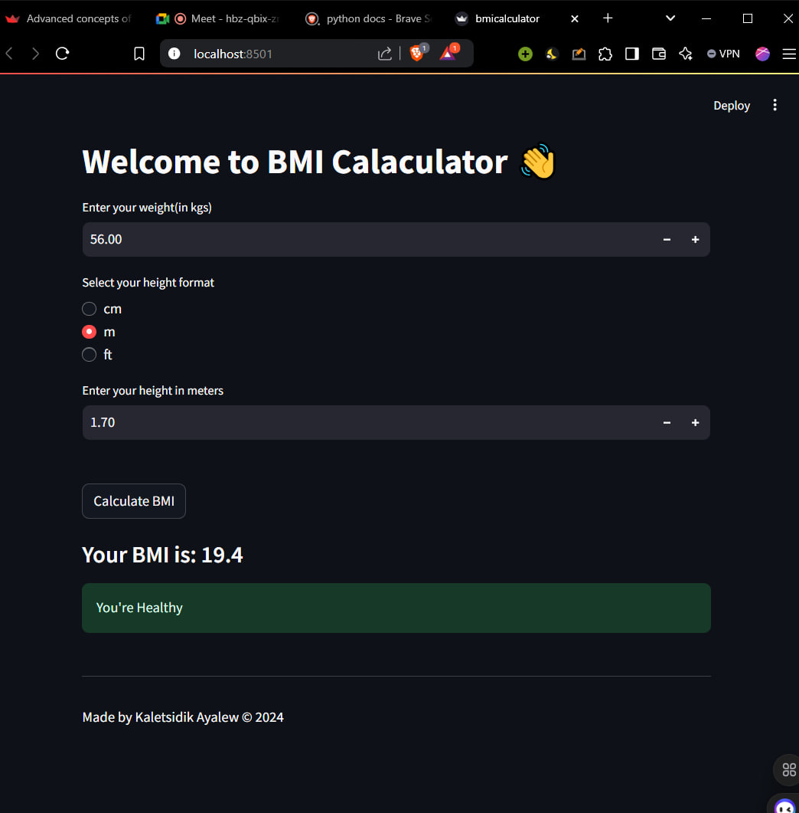

<!-- open image demo1.jpg -->

# HealthyBMI-Tracker

Welcome to the BMI Calculator!👋 This application helps users calculate their Body Mass Index (BMI) based on their weight and height. It provides feedback on whether the user is underweight, healthy, overweight, or obese.


## Features
- Input weight in kilograms.
- Input height in multiple formats: centimeters, meters, or feet.
- Calculate BMI and provide health status feedback.
- User-friendly interface built with Streamlit.

## Technologies Used
- [Python](https://www.python.org/) - Programming language
- [Streamlit](https://streamlit.io/) - Framework for building web applications

## Installation
To set up the project locally, follow these steps:

1. **Clone the repository**:
   ```bash
   git clone https://github.com/AlexKalll/HealthyBMI-Tracker.git
2. Navigate to the project directory:
   ```bash
   cd HealthyBMI-Tracker
3. Install the required packages:
   ```bash
   streamlit run app.py
4. Run the application:
   ```bash
   streamlit run bimicalculator.py

# Contributing
Contributions are welcome! If you have suggestions for improvements or new features, please fork the repository and submit a pull request.

# Contact Me 
Kaletsidik Ayalew
alexkalalw@gmail.com